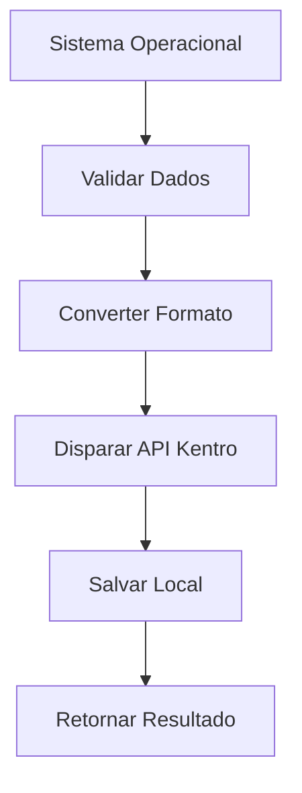
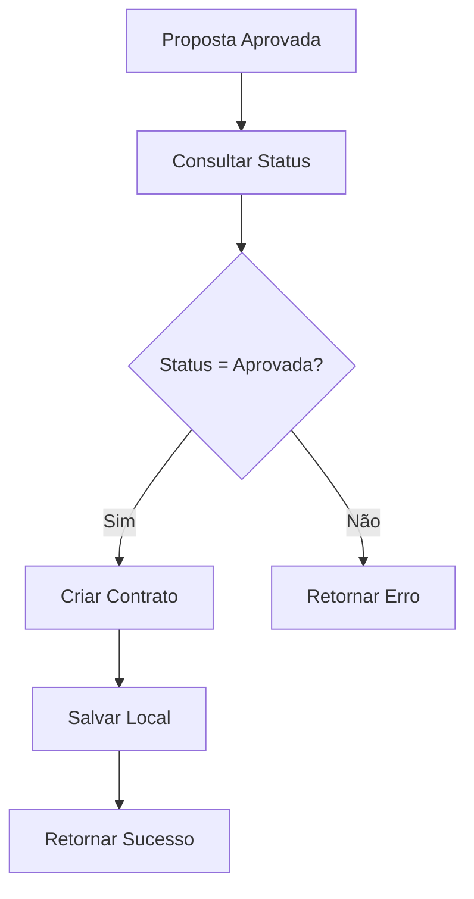

# 🔗 Integração Kentro API com Sistema Operacional

## 📋 Visão Geral

Este documento descreve como integrar a API Kentro com o Sistema Operacional para processamento de propostas FGTS.

## 🚀 Instalação

### 1. **Instalar Dependências**
```bash
cd "@KENTRO API"
npm install
```

### 2. **Configurar Variáveis de Ambiente**
```bash
cp env.example .env
# Editar .env com suas credenciais
```

### 3. **Configurar Credenciais**
```env
KENTRO_TOKEN=seu_token_aqui
KENTRO_API_KEY=sua_api_key_aqui
NODE_ENV=development
```

## 🔧 Uso Básico

### **Importar e Configurar**
```javascript
const OperacionalKentroIntegration = require('./operacional-integration');

const integration = new OperacionalKentroIntegration();
```

### **Processar Proposta**
```javascript
const dadosOperacional = {
  id: 'proposta_123',
  cliente: {
    cpf: '12345678901',
    nome: 'João Silva',
    nb: '1234567890',
    especie: 'Aposentadoria',
    telefone: '(11) 99999-9999'
  },
  proposta: {
    valor: 15000.00,
    parcelas: 84,
    margem: 0.03
  }
};

const resultado = await integration.processarProposta(dadosOperacional);
console.log('Proposta processada:', resultado);
```

### **Criar Contrato**
```javascript
const dadosContrato = {
  clienteId: 'cliente_456',
  valor: 15000.00,
  parcelas: 84,
  taxaJuros: 0.03,
  valorParcela: 178.57,
  dataVencimento: '2025-02-01',
  banco: 'Banco do Brasil',
  agencia: '1234',
  conta: '567890',
  dadosBancarios: {
    banco: '001',
    agencia: '1234',
    conta: '567890',
    digito: '1'
  }
};

const contrato = await integration.criarContrato('proposta_123', dadosContrato);
console.log('Contrato criado:', contrato);
```

## 🔄 Fluxo de Integração

### **1. Proposta FGTS**


### **2. Criação de Contrato**


## 📊 Monitoramento

### **Estatísticas**
```javascript
const stats = integration.getStats();
console.log('Estatísticas:', stats);
```

### **Health Check**
```javascript
const health = await integration.healthCheck();
console.log('Status:', health.status);
```

### **Rate Limit**
```javascript
const rateLimit = integration.kentro.getRateLimitStats();
console.log('Rate Limit:', rateLimit);
```

## 🚨 Tratamento de Erros

### **Erros de Validação**
```javascript
try {
  await integration.processarProposta(dadosInvalidos);
} catch (error) {
  if (error.message.includes('CPF inválido')) {
    // Tratar erro de CPF
  } else if (error.message.includes('Valor inválido')) {
    // Tratar erro de valor
  }
}
```

### **Erros de API**
```javascript
try {
  await integration.processarProposta(dados);
} catch (error) {
  if (error.message.includes('Rate limit')) {
    // Aguardar e tentar novamente
    await new Promise(resolve => setTimeout(resolve, 60000));
  } else if (error.message.includes('Network Error')) {
    // Tentar novamente
  }
}
```

## 🔧 Configuração Avançada

### **Rate Limiting**
```javascript
// Configurar rate limiting personalizado
const client = new KentroClient('development');
client.rateLimiters.set('disparar', []);
```

### **Retry Logic**
```javascript
// Configurar retry personalizado
const client = new KentroClient('development');
client.apiConfig.retries = 5;
client.apiConfig.timeout = 60000;
```

### **Logging**
```javascript
// Configurar logging
process.env.KENTRO_LOG_LEVEL = 'debug';
process.env.DEBUG = 'kentro:*';
```

## 📝 Exemplos Completos

### **Exemplo 1: Fluxo Completo**
```javascript
const integration = new OperacionalKentroIntegration();

async function fluxoCompleto() {
  try {
    // 1. Processar proposta
    const proposta = await integration.processarProposta(dadosOperacional);
    
    // 2. Aguardar processamento
    await new Promise(resolve => setTimeout(resolve, 5000));
    
    // 3. Consultar status
    const status = await integration.consultarStatusProposta(proposta.propostaId);
    
    // 4. Se aprovada, criar contrato
    if (status.data.status === 'approved') {
      const contrato = await integration.criarContrato(proposta.propostaId, dadosContrato);
      console.log('Contrato criado:', contrato.contratoId);
    }
    
  } catch (error) {
    console.error('Erro no fluxo:', error.message);
  }
}
```

### **Exemplo 2: Processamento em Lote**
```javascript
async function processarLote(propostas) {
  const resultados = [];
  
  for (const proposta of propostas) {
    try {
      const resultado = await integration.processarProposta(proposta);
      resultados.push({ success: true, data: resultado });
    } catch (error) {
      resultados.push({ success: false, error: error.message });
    }
  }
  
  return resultados;
}
```

### **Exemplo 3: Monitoramento Contínuo**
```javascript
async function monitorar() {
  setInterval(async () => {
    const health = await integration.healthCheck();
    const stats = integration.getStats();
    
    console.log('Health:', health.status);
    console.log('Stats:', stats);
    
    // Enviar alertas se necessário
    if (stats.erros > 10) {
      console.warn('⚠️ Muitos erros detectados!');
    }
    
  }, 30000); // A cada 30 segundos
}
```

## 🔐 Segurança

### **Autenticação**
```javascript
// Configurar autenticação
integration.kentro.setAuth(token, apiKey);
```

### **Validação de Dados**
```javascript
// Validar dados antes de enviar
integration.validarDadosOperacional(dados);
```

### **Rate Limiting**
```javascript
// Verificar rate limit antes de enviar
await integration.kentro.checkRateLimit('disparar');
```

## 📈 Performance

### **Otimizações**
- Use connection pooling
- Implemente cache para consultas frequentes
- Configure timeouts apropriados
- Monitore rate limits

### **Métricas**
```javascript
const stats = integration.getStats();
console.log('Propostas enviadas:', stats.propostasEnviadas);
console.log('Contratos criados:', stats.contratosCriados);
console.log('Erros:', stats.erros);
```

## 🧪 Testes

### **Executar Testes**
```bash
npm test
```

### **Testes com Coverage**
```bash
npm run test:coverage
```

### **Testes em Watch Mode**
```bash
npm run test:watch
```

## 📚 Documentação da API

### **Endpoints Disponíveis**
- `POST /fgts/disparar` - Disparar proposta
- `POST /fgts/criar-contrato` - Criar contrato
- `GET /fgts/status/{id}` - Consultar status
- `GET /fgts/contratos/{id}` - Listar contratos

### **Códigos de Erro**
- `FGTS_001` - CPF inválido
- `FGTS_002` - Saldo insuficiente
- `FGTS_003` - Cliente não autorizado
- `CTR_001` - Proposta não encontrada
- `CTR_002` - Dados bancários inválidos

## 🆘 Suporte

### **Contato**
- **Email:** api-support@kentro.com.br
- **Telefone:** (11) 99999-9999
- **Documentação:** https://api-kentro.lunas.com.br/docs

### **Status da API**
- **Status Page:** https://status.kentro.com.br
- **Uptime:** 99.9%
- **SLA:** 4 horas de resposta

---

**Última atualização:** 01/01/2025  
**Versão:** 1.0.0  
**Mantenedor:** Equipe Lunas Digital


