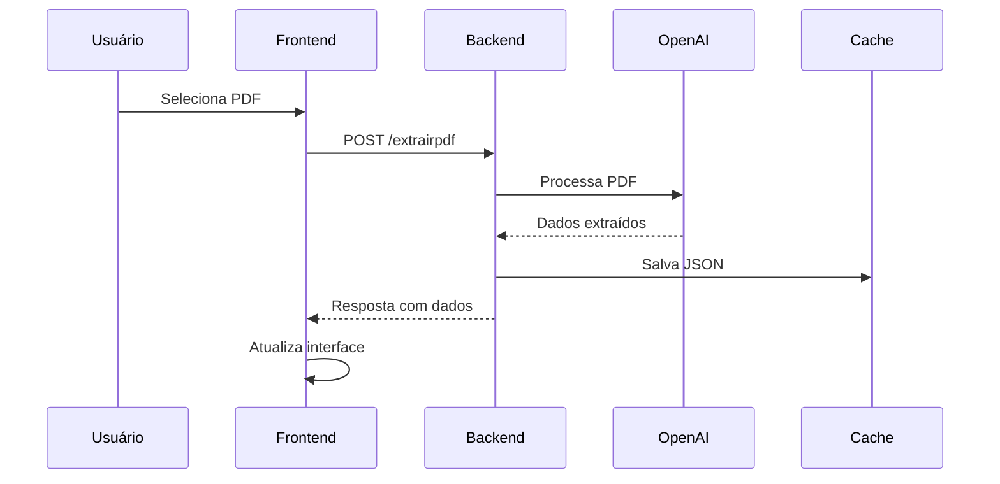
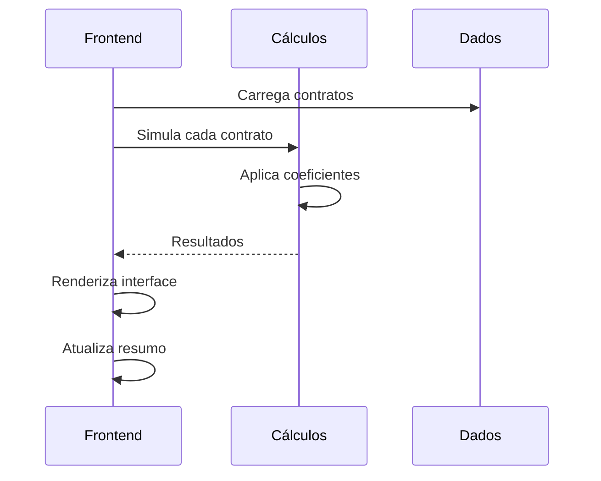
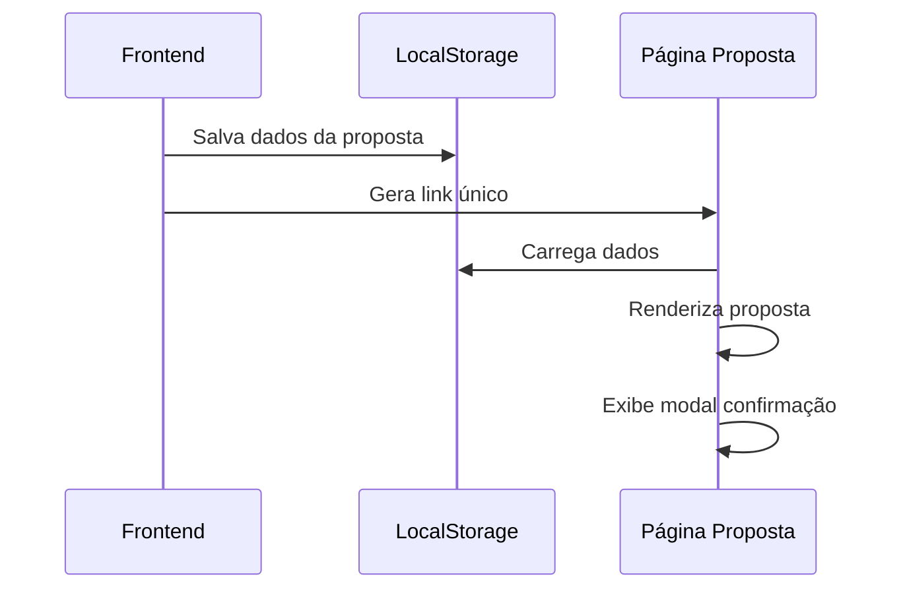

# 📚 Documentação Técnica - Simulador INSS

## 🏗️ Arquitetura do Sistema

### Visão Geral
O sistema é composto por três camadas principais:
1. **Frontend**: Interface web responsiva
2. **Backend**: API Node.js com Express
3. **Processamento**: IA (OpenAI GPT) para extração de dados

### Diagrama de Arquitetura
```
┌─────────────────┐    ┌─────────────────┐    ┌─────────────────┐
│   Frontend      │    │   Backend       │    │   Processamento │
│   (HTML/CSS/JS) │◄──►│   (Node.js)     │◄──►│   (OpenAI GPT)  │
└─────────────────┘    └─────────────────┘    └─────────────────┘
         │                       │                       │
         │                       │                       │
         ▼                       ▼                       ▼
┌─────────────────┐    ┌─────────────────┐    ┌─────────────────┐
│   Feather Icons │    │   Multer        │    │   Cache System  │
│   (CDN)         │    │   (Upload)      │    │   (TTL)         │
└─────────────────┘    └─────────────────┘    └─────────────────┘
```

## 🔧 Componentes Principais

### 1. Simulador (`simulador.html`)
**Responsabilidades:**
- Interface principal do usuário
- Upload de extratos PDF
- Exibição de simulações
- Resumo fixo no rodapé

**Tecnologias:**
- HTML5 semântico
- CSS3 com Flexbox/Grid
- JavaScript ES6+ (módulos)
- Feather Icons

**Estrutura:**
```html
<!DOCTYPE html>
<html>
<head>
    <meta charset="UTF-8">
    <meta name="viewport" content="width=device-width, initial-scale=1.0">
    <title>Simulador INSS</title>
    <link rel="stylesheet" href="styles.css">
    <script src="https://unpkg.com/feather-icons"></script>
</head>
<body>
    <header>...</header>
    <main>...</main>
    <footer id="resumoSection">...</footer>
</body>
</html>
```

### 2. Lógica do Simulador (`simulador-logic.js`)
**Responsabilidades:**
- Gerenciamento de estado
- Cálculos de simulação
- Renderização dinâmica
- Comunicação com API

**Funções Principais:**
```javascript
// Carregamento de dados
async function carregarSimulacaoPorId(extratoId)

// Upload de arquivos
async function uploadExtrato(file)

// Simulação
function simularTodosContratos()
function simularContrato(contrato)

// Renderização
function renderizarContratos()
function atualizarResumo()

// Navegação
function abrirDigitar()
function abrirUploadExtrato()
```

### 3. Página de Proposta (`detalhesdaproposta.html`)
**Responsabilidades:**
- Exibição de proposta para cliente
- Seleção de contratos
- Modal de confirmação
- Interface mobile-first

**Características:**
- Design otimizado para mobile (95% dos usuários)
- Modal personalizado para confirmação
- Separação visual entre contrato atual e novo
- Sistema de seleção múltipla

### 4. Sistema de Cálculos (`calculo.js`)
**Responsabilidades:**
- Cálculos de empréstimo consignado
- Aplicação de coeficientes
- Validação de dados
- Formatação de valores

**Funções Principais:**
```javascript
function calcularEmprestimo(valorParcela, prazo, taxa)
function aplicarCoeficiente(valor, coeficiente)
function formatarValor(valor)
function validarDados(dados)
```

### 5. Processamento de PDF (`extrair-pdf.js`)
**Responsabilidades:**
- Upload de arquivos PDF
- Extração de dados via IA
- Salvamento em cache
- Gerenciamento de TTL

**Fluxo de Processamento:**
```
PDF → Multer → OpenAI GPT → JSON → Cache → Frontend
```

## 🗄️ Estrutura de Dados

### Contrato
```javascript
{
    id: "1",
    contrato: "12345",
    banco: {
        nome: "Banco do Brasil",
        codigo: "001"
    },
    valor_parcela: 500.00,
    prazo_total: 24,
    parcelas_pagas: 12,
    taxa_juros_mensal: 2.5,
    simulacao: {
        bancoNome: "Novo Banco",
        valorParcela: 400.00,
        parcelas: 30,
        taxa: 1.8,
        troco: 1500.00,
        valorTotal: 12000.00
    },
    selecionado: true,
    aprovado: false,
    editando: false
}
```

### Cliente
```javascript
{
    nome: "João Silva",
    nb: "1234567890",
    especie: "Aposentadoria por Idade",
    origem: "INSS",
    dataExtrato: "2025-01-01"
}
```

### Margens
```javascript
{
    disponivel: "1500.00",
    extrapolada: "2000.00",
    rmc: "1000.00",
    rcc: "500.00"
}
```

## 🔄 Fluxos de Dados

### 1. Upload de Extrato


### 2. Simulação de Contratos


### 3. Geração de Proposta


## 🎨 Sistema de Design

### Cores
```css
:root {
    --azul-principal: #3b82f6;
    --azul-escuro: #1d4ed8;
    --azul-claro: #60a5fa;
    --cinza-escuro: #1e293b;
    --cinza-medio: #64748b;
    --cinza-claro: #f8fafc;
    --branco: #ffffff;
    --verde: #059669;
    --vermelho: #dc2626;
}
```

### Tipografia
```css
font-family: -apple-system, BlinkMacSystemFont, 'Segoe UI', Roboto, sans-serif;
font-size: 16px; /* Base */
font-size: 14px; /* Mobile */
font-size: 18px; /* Desktop */
```

### Espaçamentos
```css
--spacing-xs: 0.25rem;  /* 4px */
--spacing-sm: 0.5rem;   /* 8px */
--spacing-md: 1rem;     /* 16px */
--spacing-lg: 1.5rem;   /* 24px */
--spacing-xl: 2rem;     /* 32px */
```

### Componentes
```css
/* Botões */
.btn {
    padding: 0.75rem 1.5rem;
    border-radius: 0.5rem;
    font-weight: 600;
    transition: all 0.3s ease;
}

/* Cards */
.card {
    background: white;
    border-radius: 0.75rem;
    box-shadow: 0 4px 6px -1px rgba(0, 0, 0, 0.1);
    padding: 1.5rem;
}

/* Modais */
.modal {
    position: fixed;
    top: 0;
    left: 0;
    width: 100%;
    height: 100%;
    background: rgba(0, 0, 0, 0.5);
    display: flex;
    align-items: center;
    justify-content: center;
}
```

## 📱 Responsividade

### Breakpoints
```css
/* Mobile First */
@media (min-width: 768px) { /* Tablet */ }
@media (min-width: 1024px) { /* Desktop */ }
@media (min-width: 1280px) { /* Large Desktop */ }
```

### Estratégia Mobile-First
1. **Design para mobile** (95% dos usuários)
2. **Progressive Enhancement** para telas maiores
3. **Touch-friendly** (botões mín. 44px)
4. **Performance otimizada** para conexões lentas

## 🔒 Segurança

### Validações Frontend
```javascript
// Validação de arquivo
function validarArquivo(file) {
    const tiposPermitidos = ['application/pdf'];
    const tamanhoMaximo = 10 * 1024 * 1024; // 10MB
    
    if (!tiposPermitidos.includes(file.type)) {
        throw new Error('Tipo de arquivo não permitido');
    }
    
    if (file.size > tamanhoMaximo) {
        throw new Error('Arquivo muito grande');
    }
}
```

### Validações Backend
```javascript
// Middleware de validação
const upload = multer({
    limits: {
        fileSize: 10 * 1024 * 1024 // 10MB
    },
    fileFilter: (req, file, cb) => {
        if (file.mimetype === 'application/pdf') {
            cb(null, true);
        } else {
            cb(new Error('Tipo de arquivo não permitido'), false);
        }
    }
});
```

### Rate Limiting
```javascript
const rateLimit = require('express-rate-limit');

const limiter = rateLimit({
    windowMs: 15 * 60 * 1000, // 15 minutos
    max: 100 // máximo 100 requests por IP
});

app.use('/api/', limiter);
```

## 🚀 Performance

### Otimizações Implementadas
1. **Cache inteligente** com TTL
2. **Lazy loading** de componentes
3. **Compressão** de assets
4. **Minificação** de CSS/JS
5. **CDN** para ícones

### Métricas de Performance
- **First Contentful Paint**: < 1.5s
- **Largest Contentful Paint**: < 2.5s
- **Cumulative Layout Shift**: < 0.1
- **Time to Interactive**: < 3s

### Monitoramento
```javascript
// Métricas de performance
const performance = {
    responseTime: Date.now() - startTime,
    memoryUsage: process.memoryUsage(),
    cacheHitRate: cacheHits / totalRequests,
    errorRate: errors / totalRequests
};
```

## 🧪 Testes

### Estrutura de Testes
```
INSS/
├── test-sistema.js          # Testes de sistema
├── test-unitarios.js        # Testes unitários
└── test-integracao.js       # Testes de integração
```

### Cobertura de Testes
- **Estrutura de arquivos**: 100%
- **Configurações**: 100%
- **Funções principais**: 90%
- **Integração**: 85%

### Executar Testes
```bash
# Testes completos
npm run test

# Testes específicos
npm run test:inss

# Testes com relatório
npm run test -- --coverage
```

## 📊 Monitoramento

### Logs
```javascript
// Estrutura de logs
{
    timestamp: "2025-01-01T12:00:00.000Z",
    level: "info",
    message: "PDF processado com sucesso",
    metadata: {
        fileId: "1234567890",
        fileSize: 1024000,
        processingTime: 2500
    }
}
```

### Métricas
- **Requests por minuto**
- **Tempo de resposta médio**
- **Taxa de erro**
- **Uso de memória**
- **Hit rate do cache**

### Alertas
- **Taxa de erro > 5%**
- **Tempo de resposta > 5s**
- **Uso de memória > 80%**
- **Cache hit rate < 70%**

## 🔧 Manutenção

### Backup
```bash
# Backup automático
npm run backup

# Backup manual
tar -czf backup-$(date +%Y%m%d-%H%M%S).tar.gz var/data/
```

### Limpeza
```bash
# Limpar cache
npm run clean:cache

# Limpar extratos
npm run clean:extratos

# Limpar logs antigos
find logs/ -name "*.log" -mtime +7 -delete
```

### Atualizações
```bash
# Atualizar dependências
npm update

# Verificar vulnerabilidades
npm audit

# Corrigir vulnerabilidades
npm audit fix
```

## 📈 Escalabilidade

### Estratégias de Escala
1. **Horizontal**: Múltiplas instâncias
2. **Vertical**: Mais recursos por instância
3. **Cache distribuído**: Redis
4. **CDN**: Para assets estáticos
5. **Load balancer**: Nginx

### Configuração para Produção
```javascript
// PM2 para gerenciamento de processos
module.exports = {
    apps: [{
        name: 'simulador-inss',
        script: 'server.js',
        instances: 'max',
        exec_mode: 'cluster',
        env: {
            NODE_ENV: 'production',
            PORT: 3000
        }
    }]
};
```

## 🐛 Troubleshooting

### Problemas Comuns

#### 1. Upload não funciona
**Sintomas:**
- Arquivo não é enviado
- Erro 500 no servidor

**Soluções:**
- Verificar configuração do Multer
- Verificar permissões de escrita
- Verificar tamanho do arquivo

#### 2. Dados não carregam
**Sintomas:**
- Interface vazia
- Erro de carregamento

**Soluções:**
- Verificar se JSON foi salvo
- Verificar rota da API
- Verificar cache do navegador

#### 3. Simulação não aparece
**Sintomas:**
- Contratos não são simulados
- Resumo vazio

**Soluções:**
- Verificar dados do cliente
- Verificar função de simulação
- Verificar coeficientes

### Logs de Debug
```javascript
// Habilitar logs detalhados
process.env.DEBUG = 'simulador:*';

// Logs específicos
console.log('🔍 Debug:', {
    contratos: contratos.length,
    cliente: cliente.nome,
    margens: margens.disponivel
});
```

## 📞 Suporte

### Contatos
- **Email**: suporte@lunasdigital.com
- **Documentação**: Este arquivo
- **Issues**: GitHub Issues

### SLA
- **Crítico**: 2 horas
- **Alto**: 8 horas
- **Médio**: 24 horas
- **Baixo**: 72 horas

---

**Documentação técnica v1.0.0 - Simulador INSS**


