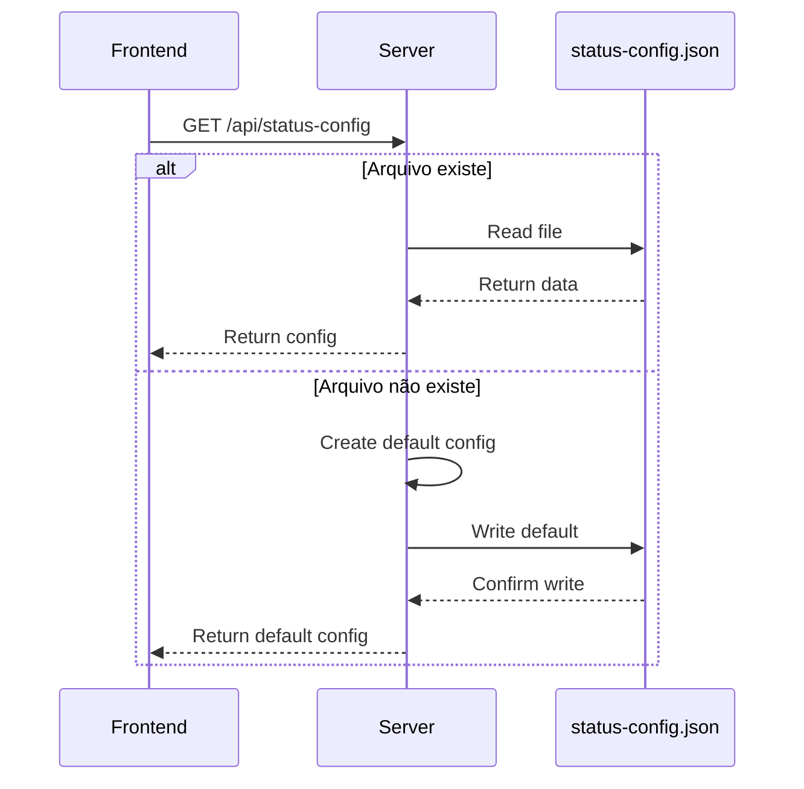
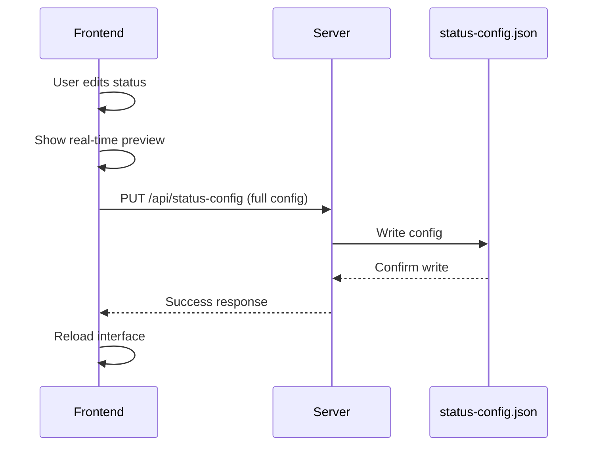
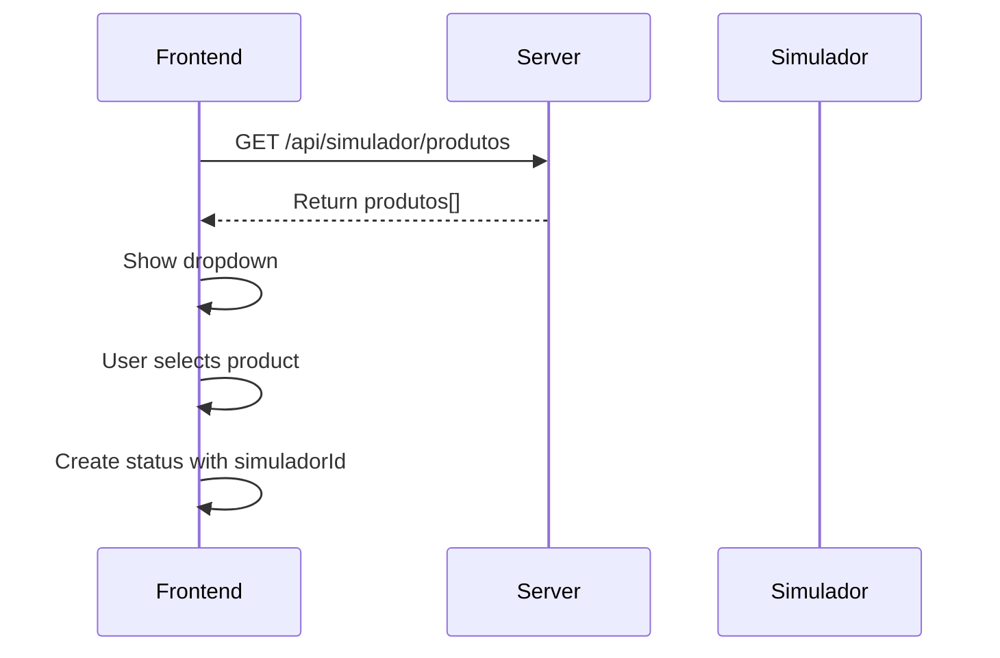
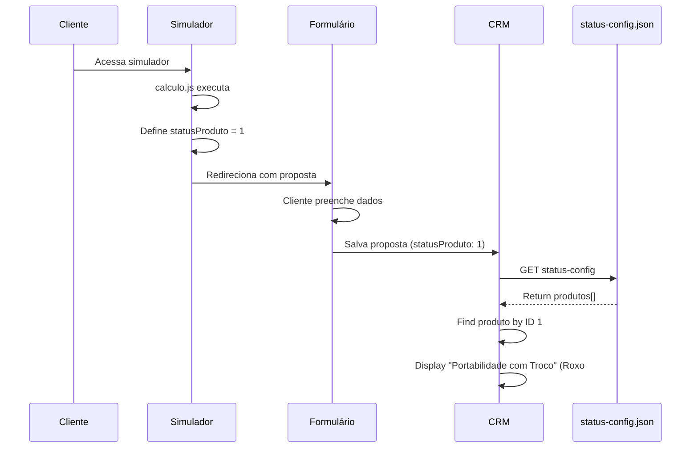

# Sistema de Status e Propostas CRM - Lunas Digital

## Visão Geral

Este documento detalha o sistema de gerenciamento de status e propostas do CRM Lunas Digital, incluindo a arquitetura, fluxo de dados e configurações.

## Índice

1. [Arquitetura do Sistema](#arquitetura-do-sistema)
2. [Tipos de Status](#tipos-de-status)
3. [Fluxo de Dados](#fluxo-de-dados)
4. [Configuração de Status](#configuração-de-status)
5. [Integração com Produtos](#integração-com-produtos)
6. [API Endpoints](#api-endpoints)
7. [Front-end Components](#front-end-components)

---

## Arquitetura do Sistema

O sistema de status é centralizado e configurável, permitindo gerenciar três categorias principais:

1. **Status do Formulário**: Etapas de preenchimento pelo cliente
2. **Status de Produtos**: Oportunidades (Calculadas ou Manuais)
3. **Status da Proposta**: Estados operacionais da proposta

### Diagrama de Arquitetura

```
┌─────────────────────────────────────────────────────────┐
│                   Frontend (HTML/JS)                    │
│  ┌────────────────────────────────────────────────────┐ │
│  │  configuracoes-status.html                         │ │
│  │  - Interface de gerenciamento de status            │ │
│  │  - Preview em tempo real                           │ │
│  │  - Configuração WhatsApp                           │ │
│  └────────────────────────────────────────────────────┘ │
└─────────────────────────────────────────────────────────┘
                           │
                           │ HTTP
                           ▼
┌─────────────────────────────────────────────────────────┐
│                   Backend (Node.js)                     │
│  ┌────────────────────────────────────────────────────┐ │
│  │  server.js                                         │ │
│  │  - GET  /api/status-config                        │ │
│  │  - PUT  /api/status-config                        │ │
│  │  - GET  /api/simulador/produtos                   │ │
│  └────────────────────────────────────────────────────┘ │
└─────────────────────────────────────────────────────────┘
                           │
                           │ File I/O
                           ▼
┌─────────────────────────────────────────────────────────┐
│            var/data/status-config.json                  │
│  - statusFormulario[]                                   │
│  - produtos[]                                           │
│  - statusProposta[]                                     │
└─────────────────────────────────────────────────────────┘
```

---

## Tipos de Status

### 1. Status do Formulário

**Descrição**: Etapas fixas do formulário de cadastro do cliente.

**Características**:
- IDs fixos e não editáveis (`etapa1`, `etapa2`, `etapa3`, `etapa4`, `finalizado`)
- Apenas a cor pode ser customizada
- Representam o progresso do cliente no preenchimento

**Estrutura JSON**:
```json
{
  "id": "etapa1",
  "nome": "Etapa 1 - Dados",
  "descricao": "Cliente preenchendo dados pessoais",
  "cor": "#3B82F6",
  "fixo": true,
  "editavel": false
}
```

**Status Padrão**:
- `etapa1`: Etapa 1 - Dados (Azul #3B82F6)
- `etapa2`: Etapa 2 - Endereço (Azul #3B82F6)
- `etapa3`: Etapa 3 - Benefício (Azul #3B82F6)
- `etapa4`: Etapa 4 - Dados Bancários (Azul #3B82F6)
- `finalizado`: Cliente Finalizou (Verde #10B981)

---

### 2. Status de Produtos (Oportunidades)

**Descrição**: Produtos disponíveis para simulação e propostas.

**Características**:
- Podem ser **Calculados** (vindos do simulador) ou **Manuais** (criados manualmente)
- Produtos calculados estão vinculados a um `simuladorId`
- Editáveis (nome, descrição, cor)
- Podem ser criados, editados ou excluídos

**Estrutura JSON - Produto Calculado**:
```json
{
  "id": 1,
  "nome": "Portabilidade com Troco",
  "descricao": "Portabilidade de empréstimo com troco",
  "cor": "#8B5CF6",
  "origem": "calculo",
  "simuladorId": 1,
  "editavel": true
}
```

**Estrutura JSON - Produto Manual**:
```json
{
  "id": 2,
  "nome": "FGTS",
  "descricao": "Saque do FGTS",
  "cor": "#F59E0B",
  "origem": "manual",
  "editavel": true
}
```

**Produtos Padrão**:
| ID | Nome | Origem | Simulador ID | Cor |
|----|------|--------|--------------|-----|
| 1 | Portabilidade com Troco | Calculado | 1 | #8B5CF6 |
| 2 | FGTS | Manual | - | #F59E0B |
| 3 | Margem Nova | Calculado | 3 | #EF4444 |
| 4 | Cartão RMC | Manual | - | #06B6D4 |
| 5 | Cartão RCC | Manual | - | #84CC16 |

**Origem dos Produtos**:
- **`calculo`**: Produto gerado automaticamente pelo simulador (ex: `INSS/calculo.js`)
- **`manual`**: Produto criado manualmente pelo operador

**Quando usar Calculado vs Manual**:
- **Calculado**: Use quando o produto tem lógica de cálculo no simulador
  - Exemplo: Portabilidade com Troco (cálculo de margem, saldo devedor, etc.)
- **Manual**: Use quando o produto não tem cálculo automático
  - Exemplo: FGTS (apenas informações cadastrais)

---

### 3. Status da Proposta

**Descrição**: Estados operacionais da proposta no processo de digitação/aprovação.

**Características**:
- Editáveis (nome, descrição, cor)
- Podem ser criados, editados ou excluídos
- Possuem configuração de WhatsApp (template, variáveis, ativo/inativo)
- Representam o ciclo de vida operacional da proposta

**Estrutura JSON**:
```json
{
  "id": "digitando",
  "nome": "Digitando",
  "descricao": "Proposta sendo digitada",
  "cor": "#F59E0B",
  "editavel": true,
  "whatsapp": {
    "ativo": false,
    "template": "Olá {nome}, sua proposta está sendo digitada. Aguarde nosso retorno.",
    "variaveis": ["nome", "etapa", "valor", "banco"]
  }
}
```

**Status Padrão**:
| ID | Nome | Descrição | Cor | WhatsApp |
|----|------|-----------|-----|----------|
| `digitando` | Digitando | Proposta sendo digitada | #F59E0B | Inativo |
| `cancelado` | Cancelado | Proposta cancelada | #EF4444 | Inativo |
| `aprovado` | Aprovado | Proposta aprovada | #10B981 | Ativo |
| `em_analise` | Em Análise | Proposta em análise | #3B82F6 | Inativo |
| `ag_saldo_cip` | Ag. Saldo CIP | Aguardando saldo CIP | #8B5CF6 | Inativo |

---

## Fluxo de Dados

### 1. Inicialização do Sistema



### 2. Criação/Edição de Status



### 3. Sincronização com Simulador



---

## Configuração de Status

### Interface de Configuração

**Arquivo**: `operacional/configuracoes-status.html`

**Funcionalidades**:
1. **Visualização**: Listar todos os status de cada categoria
2. **Edição**: Modificar nome, descrição e cor
3. **Preview em Tempo Real**: Visualizar como o status aparecerá no sistema
4. **Adicionar Produto**: Criar novos produtos (Manual ou Calculado)
5. **Configuração WhatsApp**: Preparar templates para integração futura

### Preview em Tempo Real

**Como Funciona**:
1. Usuário edita campos de status
2. JavaScript atualiza preview instantaneamente
3. Preview mostra:
   - Badge na fila de digitação
   - Dropdown selection
   - Aplicação de cores

**Código Exemplo**:
```javascript
function atualizarPreview(statusData) {
  const previewBadge = document.querySelector('.preview-badge');
  previewBadge.style.backgroundColor = statusData.cor;
  previewBadge.textContent = statusData.nome;
  
  const previewOption = document.querySelector('.preview-option');
  previewOption.textContent = statusData.nome;
}
```

### Adicionar Produto

**Opções**:
1. **Manual**: Criar produto sem vínculo com simulador
   - Sem `simuladorId`
   - `origem: "manual"`
   
2. **Calculado**: Vincular produto ao simulador
   - Requer seleção de produto do simulador
   - `simuladorId` definido
   - `origem: "calculo"`

**Fluxo**:
```
[Adicionar Produto] → Escolher origem → 
  ├─ Manual → Preencher dados → Salvar
  └─ Calculado → Selecionar produto do simulador → Preencher dados → Salvar
```

---

## Integração com Produtos

### Produtos do Simulador

**Fonte**: `INSS/calculo.js`

**Como Funciona**:
1. Simulador gera produto com ID específico
2. Produto é vinculado ao `statusProduto` da proposta
3. CRM usa `statusProduto` para identificar tipo de proposta

**Exemplo de Vinculação**:
```javascript
// No simulador (calculo.js)
const proposta = {
  statusProduto: 1, // Portabilidade com Troco
  // ... outros dados
};

// No CRM
const produto = statusConfig.produtos.find(p => p.id === proposta.statusProduto);
// produto.nome = "Portabilidade com Troco"
// produto.cor = "#8B5CF6"
```

### Fluxo Completo: Simulador → Proposta → CRM



---

## API Endpoints

### GET /api/status-config

**Descrição**: Retorna a configuração completa de status.

**Request**:
```http
GET /api/status-config HTTP/1.1
Host: lunasdigital.com.br
```

**Response**:
```json
{
  "statusFormulario": [
    {
      "id": "etapa1",
      "nome": "Etapa 1 - Dados",
      "descricao": "Cliente preenchendo dados pessoais",
      "cor": "#3B82F6",
      "fixo": true,
      "editavel": false
    }
    // ...
  ],
  "produtos": [
    {
      "id": 1,
      "nome": "Portabilidade com Troco",
      "descricao": "Portabilidade de empréstimo com troco",
      "cor": "#8B5CF6",
      "origem": "calculo",
      "simuladorId": 1,
      "editavel": true
    }
    // ...
  ],
  "statusProposta": [
    {
      "id": "digitando",
      "nome": "Digitando",
      "descricao": "Proposta sendo digitada",
      "cor": "#F59E0B",
      "editavel": true,
      "whatsapp": {
        "ativo": false,
        "template": "Olá {nome}, sua proposta está sendo digitada. Aguarde nosso retorno.",
        "variaveis": ["nome", "etapa", "valor", "banco"]
      }
    }
    // ...
  ]
}
```

---

### PUT /api/status-config

**Descrição**: Atualiza a configuração completa de status.

**Request**:
```http
PUT /api/status-config HTTP/1.1
Host: lunasdigital.com.br
Content-Type: application/json

{
  "statusFormulario": [...],
  "produtos": [...],
  "statusProposta": [...]
}
```

**Response**:
```json
{
  "success": true,
  "message": "Configurações salvas com sucesso"
}
```

---

### GET /api/simulador/produtos

**Descrição**: Retorna lista de produtos disponíveis no simulador.

**Request**:
```http
GET /api/simulador/produtos HTTP/1.1
Host: lunasdigital.com.br
```

**Response**:
```json
[
  {
    "id": 1,
    "nome": "Portabilidade com Troco",
    "descricao": "Portabilidade de empréstimo com troco",
    "tipo": "portabilidade_troco"
  },
  {
    "id": 2,
    "nome": "FGTS",
    "descricao": "Saque do FGTS",
    "tipo": "fgts"
  },
  {
    "id": 3,
    "nome": "Margem Nova",
    "descricao": "Empréstimo com margem nova",
    "tipo": "margem_nova"
  }
]
```

---

## Front-end Components

### configuracoes-status.html

**Funcionalidades**:
1. Listar e editar status do formulário
2. Listar, criar, editar e excluir produtos
3. Listar, criar, editar e excluir status de proposta
4. Preview em tempo real
5. Sincronizar com simulador
6. Configurar WhatsApp (preparação)

**Principais Funções JavaScript**:
```javascript
// Carregar configurações do servidor
async function carregarConfiguracoes() {
  const response = await fetch('/api/status-config');
  const config = await response.json();
  renderizarStatus(config);
}

// Salvar configurações no servidor
async function salvarNoServidor() {
  const config = prepararConfig();
  await fetch('/api/status-config', {
    method: 'PUT',
    headers: { 'Content-Type': 'application/json' },
    body: JSON.stringify(config)
  });
}

// Sincronizar produtos do simulador
async function carregarProdutosSimulador() {
  const response = await fetch('/api/simulador/produtos');
  const produtos = await response.json();
  popularDropdownProdutos(produtos);
}

// Atualizar preview em tempo real
function atualizarPreview(statusData) {
  const previewBadge = document.querySelector('.preview-badge');
  previewBadge.style.backgroundColor = statusData.cor;
  previewBadge.textContent = statusData.nome;
}
```

---

### digitation-interface.html

**Como usa os Status**:
```javascript
// Carregar status de produtos
const statusConfig = await fetch('/api/status-config').then(r => r.json());

// Exibir badge de produto
function renderizarProduto(proposta) {
  const produto = statusConfig.produtos.find(p => p.id === proposta.statusProduto);
  return `<span class="badge" style="background-color: ${produto.cor}">${produto.nome}</span>`;
}
```

---

### digitar-proposta.html

**Como usa os Status**:
```javascript
// Carregar status de propostas
const statusConfig = await fetch('/api/status-config').then(r => r.json());

// Dropdown de status
function renderizarDropdownStatus() {
  return statusConfig.statusProposta.map(status => `
    <option value="${status.id}" style="color: ${status.cor}">
      ${status.nome}
    </option>
  `).join('');
}
```

---

## Fluxo de Integração WhatsApp (Preparação)

### Estrutura de Configuração

**Cada status de proposta possui**:
```json
{
  "whatsapp": {
    "ativo": false,
    "template": "Olá {nome}, sua proposta está sendo digitada. Aguarde nosso retorno.",
    "variaveis": ["nome", "etapa", "valor", "banco"]
  }
}
```

**Variáveis Disponíveis**:
- `{nome}`: Nome do cliente
- `{etapa}`: Etapa atual da proposta
- `{valor}`: Valor da proposta
- `{banco}`: Banco da proposta

### Exemplo de Template

```javascript
const mensagem = template
  .replace('{nome}', cliente.nome)
  .replace('{etapa}', proposta.etapa)
  .replace('{valor}', formatarValor(proposta.valor))
  .replace('{banco}', proposta.banco);
```

### Preparação para API Kentro

**Estrutura de Payload (Futuro)**:
```javascript
const whatsappPayload = {
  telefone: cliente.telefone,
  mensagem: mensagemFormatada,
  status: proposta.status,
  prioridade: status.whatsapp.prioridade || 'normal',
  agendamento: status.whatsapp.delay || 0
};

// await fetch('https://api.kentro.com/whatsapp/send', {
//   method: 'POST',
//   headers: { 'Content-Type': 'application/json' },
//   body: JSON.stringify(whatsappPayload)
// });
```

---

## Boas Práticas

### 1. Cores

**Recomendações**:
- Use cores distintas para cada produto/status
- Mantenha consistência visual
- Prefira cores da paleta Tailwind CSS para compatibilidade

**Paleta Sugerida**:
- Azul: #3B82F6 (Informação, Etapas)
- Verde: #10B981 (Sucesso, Aprovado)
- Amarelo: #F59E0B (Atenção, Em Processo)
- Vermelho: #EF4444 (Erro, Cancelado)
- Roxo: #8B5CF6 (Produto Premium)
- Ciano: #06B6D4 (Produto Secundário)
- Lima: #84CC16 (Produto Terciário)

### 2. Nomes e Descrições

**Recomendações**:
- Use nomes curtos e descritivos
- Descrições devem explicar o propósito
- Evite jargões técnicos nos nomes

**Exemplos**:
✅ "Portabilidade com Troco" (claro e direto)
❌ "PORT_TROCO_V2" (técnico demais)

### 3. IDs

**Recomendações**:
- Use IDs sequenciais para produtos (1, 2, 3...)
- Use snake_case para status (`em_analise`, `ag_saldo_cip`)
- Nunca reutilize IDs deletados

### 4. Origem dos Produtos

**Quando usar `calculo`**:
- Produto tem lógica de cálculo no simulador
- Precisa de dados de contrato/benefício
- Exemplo: Portabilidade com Troco

**Quando usar `manual`**:
- Produto não requer cálculo automático
- Apenas dados cadastrais
- Exemplo: FGTS, Cartão RMC

---

## Troubleshooting

### Problema: Status não aparece no CRM

**Solução**:
1. Verificar se `/api/status-config` retorna dados
2. Verificar console do navegador para erros
3. Confirmar que `statusProduto` da proposta existe em `produtos[]`

### Problema: Produto calculado não funciona

**Solução**:
1. Verificar se `simuladorId` está correto
2. Confirmar que `origem: "calculo"` está definido
3. Verificar se o simulador está gerando o ID correto

### Problema: Cores não aplicadas

**Solução**:
1. Verificar formato de cor (deve ser hex: #RRGGBB)
2. Limpar cache do navegador (Ctrl+Shift+R)
3. Verificar se CSS inline está sendo aplicado

---

## Changelog

### v1.0.0 (04/01/2025)
- ✅ Sistema inicial de status configurável
- ✅ Interface de configuração com preview em tempo real
- ✅ Integração com produtos do simulador
- ✅ Preparação para integração WhatsApp
- ✅ Correção do produto FGTS de "Calculado" para "Manual"

---

## Próximos Passos

1. **Integração WhatsApp**:
   - Implementar disparo automático via API Kentro
   - Configurar agendamento e prioridades

2. **Analytics**:
   - Rastrear mudanças de status
   - Gerar relatórios de conversão

3. **Notificações**:
   - Alertas para operadores sobre mudanças de status
   - Push notifications no navegador

4. **Automação**:
   - Transições automáticas de status baseadas em regras
   - Webhooks para integrações externas

---

## Contribuindo

Para sugerir melhorias ou reportar bugs no sistema de status, consulte o arquivo `CONTRIBUTING.md`.

---

## Licença

© 2025 Lunas Digital - Todos os direitos reservados.

## Visão Geral

Este documento detalha o sistema de gerenciamento de status e propostas do CRM Lunas Digital, incluindo a arquitetura, fluxo de dados e configurações.

## Índice

1. [Arquitetura do Sistema](#arquitetura-do-sistema)
2. [Tipos de Status](#tipos-de-status)
3. [Fluxo de Dados](#fluxo-de-dados)
4. [Configuração de Status](#configuração-de-status)
5. [Integração com Produtos](#integração-com-produtos)
6. [API Endpoints](#api-endpoints)
7. [Front-end Components](#front-end-components)

---

## Arquitetura do Sistema

O sistema de status é centralizado e configurável, permitindo gerenciar três categorias principais:

1. **Status do Formulário**: Etapas de preenchimento pelo cliente
2. **Status de Produtos**: Oportunidades (Calculadas ou Manuais)
3. **Status da Proposta**: Estados operacionais da proposta

### Diagrama de Arquitetura

```
┌─────────────────────────────────────────────────────────┐
│                   Frontend (HTML/JS)                    │
│  ┌────────────────────────────────────────────────────┐ │
│  │  configuracoes-status.html                         │ │
│  │  - Interface de gerenciamento de status            │ │
│  │  - Preview em tempo real                           │ │
│  │  - Configuração WhatsApp                           │ │
│  └────────────────────────────────────────────────────┘ │
└─────────────────────────────────────────────────────────┘
                           │
                           │ HTTP
                           ▼
┌─────────────────────────────────────────────────────────┐
│                   Backend (Node.js)                     │
│  ┌────────────────────────────────────────────────────┐ │
│  │  server.js                                         │ │
│  │  - GET  /api/status-config                        │ │
│  │  - PUT  /api/status-config                        │ │
│  │  - GET  /api/simulador/produtos                   │ │
│  └────────────────────────────────────────────────────┘ │
└─────────────────────────────────────────────────────────┘
                           │
                           │ File I/O
                           ▼
┌─────────────────────────────────────────────────────────┐
│            var/data/status-config.json                  │
│  - statusFormulario[]                                   │
│  - produtos[]                                           │
│  - statusProposta[]                                     │
└─────────────────────────────────────────────────────────┘
```

---

## Tipos de Status

### 1. Status do Formulário

**Descrição**: Etapas fixas do formulário de cadastro do cliente.

**Características**:
- IDs fixos e não editáveis (`etapa1`, `etapa2`, `etapa3`, `etapa4`, `finalizado`)
- Apenas a cor pode ser customizada
- Representam o progresso do cliente no preenchimento

**Estrutura JSON**:
```json
{
  "id": "etapa1",
  "nome": "Etapa 1 - Dados",
  "descricao": "Cliente preenchendo dados pessoais",
  "cor": "#3B82F6",
  "fixo": true,
  "editavel": false
}
```

**Status Padrão**:
- `etapa1`: Etapa 1 - Dados (Azul #3B82F6)
- `etapa2`: Etapa 2 - Endereço (Azul #3B82F6)
- `etapa3`: Etapa 3 - Benefício (Azul #3B82F6)
- `etapa4`: Etapa 4 - Dados Bancários (Azul #3B82F6)
- `finalizado`: Cliente Finalizou (Verde #10B981)

---

### 2. Status de Produtos (Oportunidades)

**Descrição**: Produtos disponíveis para simulação e propostas.

**Características**:
- Podem ser **Calculados** (vindos do simulador) ou **Manuais** (criados manualmente)
- Produtos calculados estão vinculados a um `simuladorId`
- Editáveis (nome, descrição, cor)
- Podem ser criados, editados ou excluídos

**Estrutura JSON - Produto Calculado**:
```json
{
  "id": 1,
  "nome": "Portabilidade com Troco",
  "descricao": "Portabilidade de empréstimo com troco",
  "cor": "#8B5CF6",
  "origem": "calculo",
  "simuladorId": 1,
  "editavel": true
}
```

**Estrutura JSON - Produto Manual**:
```json
{
  "id": 2,
  "nome": "FGTS",
  "descricao": "Saque do FGTS",
  "cor": "#F59E0B",
  "origem": "manual",
  "editavel": true
}
```

**Produtos Padrão**:
| ID | Nome | Origem | Simulador ID | Cor |
|----|------|--------|--------------|-----|
| 1 | Portabilidade com Troco | Calculado | 1 | #8B5CF6 |
| 2 | FGTS | Manual | - | #F59E0B |
| 3 | Margem Nova | Calculado | 3 | #EF4444 |
| 4 | Cartão RMC | Manual | - | #06B6D4 |
| 5 | Cartão RCC | Manual | - | #84CC16 |

**Origem dos Produtos**:
- **`calculo`**: Produto gerado automaticamente pelo simulador (ex: `INSS/calculo.js`)
- **`manual`**: Produto criado manualmente pelo operador

**Quando usar Calculado vs Manual**:
- **Calculado**: Use quando o produto tem lógica de cálculo no simulador
  - Exemplo: Portabilidade com Troco (cálculo de margem, saldo devedor, etc.)
- **Manual**: Use quando o produto não tem cálculo automático
  - Exemplo: FGTS (apenas informações cadastrais)

---

### 3. Status da Proposta

**Descrição**: Estados operacionais da proposta no processo de digitação/aprovação.

**Características**:
- Editáveis (nome, descrição, cor)
- Podem ser criados, editados ou excluídos
- Possuem configuração de WhatsApp (template, variáveis, ativo/inativo)
- Representam o ciclo de vida operacional da proposta

**Estrutura JSON**:
```json
{
  "id": "digitando",
  "nome": "Digitando",
  "descricao": "Proposta sendo digitada",
  "cor": "#F59E0B",
  "editavel": true,
  "whatsapp": {
    "ativo": false,
    "template": "Olá {nome}, sua proposta está sendo digitada. Aguarde nosso retorno.",
    "variaveis": ["nome", "etapa", "valor", "banco"]
  }
}
```

**Status Padrão**:
| ID | Nome | Descrição | Cor | WhatsApp |
|----|------|-----------|-----|----------|
| `digitando` | Digitando | Proposta sendo digitada | #F59E0B | Inativo |
| `cancelado` | Cancelado | Proposta cancelada | #EF4444 | Inativo |
| `aprovado` | Aprovado | Proposta aprovada | #10B981 | Ativo |
| `em_analise` | Em Análise | Proposta em análise | #3B82F6 | Inativo |
| `ag_saldo_cip` | Ag. Saldo CIP | Aguardando saldo CIP | #8B5CF6 | Inativo |

---

## Fluxo de Dados

### 1. Inicialização do Sistema


### 2. Criação/Edição de Status


### 3. Sincronização com Simulador


---

## Configuração de Status

### Interface de Configuração

**Arquivo**: `operacional/configuracoes-status.html`

**Funcionalidades**:
1. **Visualização**: Listar todos os status de cada categoria
2. **Edição**: Modificar nome, descrição e cor
3. **Preview em Tempo Real**: Visualizar como o status aparecerá no sistema
4. **Adicionar Produto**: Criar novos produtos (Manual ou Calculado)
5. **Configuração WhatsApp**: Preparar templates para integração futura

### Preview em Tempo Real

**Como Funciona**:
1. Usuário edita campos de status
2. JavaScript atualiza preview instantaneamente
3. Preview mostra:
   - Badge na fila de digitação
   - Dropdown selection
   - Aplicação de cores

**Código Exemplo**:
```javascript
function atualizarPreview(statusData) {
  const previewBadge = document.querySelector('.preview-badge');
  previewBadge.style.backgroundColor = statusData.cor;
  previewBadge.textContent = statusData.nome;
  
  const previewOption = document.querySelector('.preview-option');
  previewOption.textContent = statusData.nome;
}
```

### Adicionar Produto

**Opções**:
1. **Manual**: Criar produto sem vínculo com simulador
   - Sem `simuladorId`
   - `origem: "manual"`
   
2. **Calculado**: Vincular produto ao simulador
   - Requer seleção de produto do simulador
   - `simuladorId` definido
   - `origem: "calculo"`

**Fluxo**:
```
[Adicionar Produto] → Escolher origem → 
  ├─ Manual → Preencher dados → Salvar
  └─ Calculado → Selecionar produto do simulador → Preencher dados → Salvar
```

---

## Integração com Produtos

### Produtos do Simulador

**Fonte**: `INSS/calculo.js`

**Como Funciona**:
1. Simulador gera produto com ID específico
2. Produto é vinculado ao `statusProduto` da proposta
3. CRM usa `statusProduto` para identificar tipo de proposta

**Exemplo de Vinculação**:
```javascript
// No simulador (calculo.js)
const proposta = {
  statusProduto: 1, // Portabilidade com Troco
  // ... outros dados
};

// No CRM
const produto = statusConfig.produtos.find(p => p.id === proposta.statusProduto);
// produto.nome = "Portabilidade com Troco"
// produto.cor = "#8B5CF6"
```

### Fluxo Completo: Simulador → Proposta → CRM


---

## API Endpoints

### GET /api/status-config

**Descrição**: Retorna a configuração completa de status.

**Request**:
```http
GET /api/status-config HTTP/1.1
Host: lunasdigital.com.br
```

**Response**:
```json
{
  "statusFormulario": [
    {
      "id": "etapa1",
      "nome": "Etapa 1 - Dados",
      "descricao": "Cliente preenchendo dados pessoais",
      "cor": "#3B82F6",
      "fixo": true,
      "editavel": false
    }
    // ...
  ],
  "produtos": [
    {
      "id": 1,
      "nome": "Portabilidade com Troco",
      "descricao": "Portabilidade de empréstimo com troco",
      "cor": "#8B5CF6",
      "origem": "calculo",
      "simuladorId": 1,
      "editavel": true
    }
    // ...
  ],
  "statusProposta": [
    {
      "id": "digitando",
      "nome": "Digitando",
      "descricao": "Proposta sendo digitada",
      "cor": "#F59E0B",
      "editavel": true,
      "whatsapp": {
        "ativo": false,
        "template": "Olá {nome}, sua proposta está sendo digitada. Aguarde nosso retorno.",
        "variaveis": ["nome", "etapa", "valor", "banco"]
      }
    }
    // ...
  ]
}
```

---

### PUT /api/status-config

**Descrição**: Atualiza a configuração completa de status.

**Request**:
```http
PUT /api/status-config HTTP/1.1
Host: lunasdigital.com.br
Content-Type: application/json

{
  "statusFormulario": [...],
  "produtos": [...],
  "statusProposta": [...]
}
```

**Response**:
```json
{
  "success": true,
  "message": "Configurações salvas com sucesso"
}
```

---

### GET /api/simulador/produtos

**Descrição**: Retorna lista de produtos disponíveis no simulador.

**Request**:
```http
GET /api/simulador/produtos HTTP/1.1
Host: lunasdigital.com.br
```

**Response**:
```json
[
  {
    "id": 1,
    "nome": "Portabilidade com Troco",
    "descricao": "Portabilidade de empréstimo com troco",
    "tipo": "portabilidade_troco"
  },
  {
    "id": 2,
    "nome": "FGTS",
    "descricao": "Saque do FGTS",
    "tipo": "fgts"
  },
  {
    "id": 3,
    "nome": "Margem Nova",
    "descricao": "Empréstimo com margem nova",
    "tipo": "margem_nova"
  }
]
```

---

## Front-end Components

### configuracoes-status.html

**Funcionalidades**:
1. Listar e editar status do formulário
2. Listar, criar, editar e excluir produtos
3. Listar, criar, editar e excluir status de proposta
4. Preview em tempo real
5. Sincronizar com simulador
6. Configurar WhatsApp (preparação)

**Principais Funções JavaScript**:
```javascript
// Carregar configurações do servidor
async function carregarConfiguracoes() {
  const response = await fetch('/api/status-config');
  const config = await response.json();
  renderizarStatus(config);
}

// Salvar configurações no servidor
async function salvarNoServidor() {
  const config = prepararConfig();
  await fetch('/api/status-config', {
    method: 'PUT',
    headers: { 'Content-Type': 'application/json' },
    body: JSON.stringify(config)
  });
}

// Sincronizar produtos do simulador
async function carregarProdutosSimulador() {
  const response = await fetch('/api/simulador/produtos');
  const produtos = await response.json();
  popularDropdownProdutos(produtos);
}

// Atualizar preview em tempo real
function atualizarPreview(statusData) {
  const previewBadge = document.querySelector('.preview-badge');
  previewBadge.style.backgroundColor = statusData.cor;
  previewBadge.textContent = statusData.nome;
}
```

---

### digitation-interface.html

**Como usa os Status**:
```javascript
// Carregar status de produtos
const statusConfig = await fetch('/api/status-config').then(r => r.json());

// Exibir badge de produto
function renderizarProduto(proposta) {
  const produto = statusConfig.produtos.find(p => p.id === proposta.statusProduto);
  return `<span class="badge" style="background-color: ${produto.cor}">${produto.nome}</span>`;
}
```

---

### digitar-proposta.html

**Como usa os Status**:
```javascript
// Carregar status de propostas
const statusConfig = await fetch('/api/status-config').then(r => r.json());

// Dropdown de status
function renderizarDropdownStatus() {
  return statusConfig.statusProposta.map(status => `
    <option value="${status.id}" style="color: ${status.cor}">
      ${status.nome}
    </option>
  `).join('');
}
```

---

## Fluxo de Integração WhatsApp (Preparação)

### Estrutura de Configuração

**Cada status de proposta possui**:
```json
{
  "whatsapp": {
    "ativo": false,
    "template": "Olá {nome}, sua proposta está sendo digitada. Aguarde nosso retorno.",
    "variaveis": ["nome", "etapa", "valor", "banco"]
  }
}
```

**Variáveis Disponíveis**:
- `{nome}`: Nome do cliente
- `{etapa}`: Etapa atual da proposta
- `{valor}`: Valor da proposta
- `{banco}`: Banco da proposta

### Exemplo de Template

```javascript
const mensagem = template
  .replace('{nome}', cliente.nome)
  .replace('{etapa}', proposta.etapa)
  .replace('{valor}', formatarValor(proposta.valor))
  .replace('{banco}', proposta.banco);
```

### Preparação para API Kentro

**Estrutura de Payload (Futuro)**:
```javascript
const whatsappPayload = {
  telefone: cliente.telefone,
  mensagem: mensagemFormatada,
  status: proposta.status,
  prioridade: status.whatsapp.prioridade || 'normal',
  agendamento: status.whatsapp.delay || 0
};

// await fetch('https://api.kentro.com/whatsapp/send', {
//   method: 'POST',
//   headers: { 'Content-Type': 'application/json' },
//   body: JSON.stringify(whatsappPayload)
// });
```

---

## Boas Práticas

### 1. Cores

**Recomendações**:
- Use cores distintas para cada produto/status
- Mantenha consistência visual
- Prefira cores da paleta Tailwind CSS para compatibilidade

**Paleta Sugerida**:
- Azul: #3B82F6 (Informação, Etapas)
- Verde: #10B981 (Sucesso, Aprovado)
- Amarelo: #F59E0B (Atenção, Em Processo)
- Vermelho: #EF4444 (Erro, Cancelado)
- Roxo: #8B5CF6 (Produto Premium)
- Ciano: #06B6D4 (Produto Secundário)
- Lima: #84CC16 (Produto Terciário)

### 2. Nomes e Descrições

**Recomendações**:
- Use nomes curtos e descritivos
- Descrições devem explicar o propósito
- Evite jargões técnicos nos nomes

**Exemplos**:
✅ "Portabilidade com Troco" (claro e direto)
❌ "PORT_TROCO_V2" (técnico demais)

### 3. IDs

**Recomendações**:
- Use IDs sequenciais para produtos (1, 2, 3...)
- Use snake_case para status (`em_analise`, `ag_saldo_cip`)
- Nunca reutilize IDs deletados

### 4. Origem dos Produtos

**Quando usar `calculo`**:
- Produto tem lógica de cálculo no simulador
- Precisa de dados de contrato/benefício
- Exemplo: Portabilidade com Troco

**Quando usar `manual`**:
- Produto não requer cálculo automático
- Apenas dados cadastrais
- Exemplo: FGTS, Cartão RMC

---

## Troubleshooting

### Problema: Status não aparece no CRM

**Solução**:
1. Verificar se `/api/status-config` retorna dados
2. Verificar console do navegador para erros
3. Confirmar que `statusProduto` da proposta existe em `produtos[]`

### Problema: Produto calculado não funciona

**Solução**:
1. Verificar se `simuladorId` está correto
2. Confirmar que `origem: "calculo"` está definido
3. Verificar se o simulador está gerando o ID correto

### Problema: Cores não aplicadas

**Solução**:
1. Verificar formato de cor (deve ser hex: #RRGGBB)
2. Limpar cache do navegador (Ctrl+Shift+R)
3. Verificar se CSS inline está sendo aplicado

---

## Changelog

### v1.0.0 (04/01/2025)
- ✅ Sistema inicial de status configurável
- ✅ Interface de configuração com preview em tempo real
- ✅ Integração com produtos do simulador
- ✅ Preparação para integração WhatsApp
- ✅ Correção do produto FGTS de "Calculado" para "Manual"

---

## Próximos Passos

1. **Integração WhatsApp**:
   - Implementar disparo automático via API Kentro
   - Configurar agendamento e prioridades

2. **Analytics**:
   - Rastrear mudanças de status
   - Gerar relatórios de conversão

3. **Notificações**:
   - Alertas para operadores sobre mudanças de status
   - Push notifications no navegador

4. **Automação**:
   - Transições automáticas de status baseadas em regras
   - Webhooks para integrações externas

---

## Contribuindo

Para sugerir melhorias ou reportar bugs no sistema de status, consulte o arquivo `CONTRIBUTING.md`.

---

## Licença

© 2025 Lunas Digital - Todos os direitos reservados.


